# Layer 2 — What Is a JWT?

## The One-Sentence Summary

A JWT is a **string the server signs and gives you**. You send it back on every request. The server trusts it because only the server could have created the signature.

## The 3 Parts of a JWT

A JWT looks like this:

```
xxxxx.yyyyy.zzzzz
```

Three parts, separated by dots. Each part is Base64-encoded (not encrypted — just encoded, meaning anyone can decode it).

```
HEADER.PAYLOAD.SIGNATURE
```

### Part 1 — Header

```json
{
	"alg": "HS256",
	"typ": "JWT"
}
```

Just metadata. Says: "this is a JWT, and it was signed using the HS256 algorithm." Nothing sensitive here.

### Part 2 — Payload

```json
{
	"user_id": 42,
	"role": "finance_officer",
	"email": "omar@alinsan.org",
	"exp": 1740000000
}
```

This is the **data the server put inside the token**. It tells the server who you are and what role you have. `exp` is the expiry timestamp — after this Unix timestamp, the token is invalid.

**Important:** The payload is NOT encrypted. Anyone who gets the token can decode and read it. Do NOT put passwords, secrets, or sensitive personal data in the payload.

### Part 3 — Signature

```
HMACSHA256(
  base64(header) + "." + base64(payload),
  SECRET_KEY
)
```

The server takes the header + payload, runs them through a hashing algorithm using a **secret key that only the server knows**, and produces this **signature**.

This is the lock. If anyone changes even one character of the payload — the signature no longer matches. The server will reject it.

## Token vs Signature — The Difference

These two things are often confused. Here is the clean distinction:

| Term          | What it is                                                                         |
| ------------- | ---------------------------------------------------------------------------------- |
| **Token**     | The full string: `header.payload.signature` — what you store and send              |
| **Signature** | Only the third part — a cryptographic proof that the payload was not tampered with |

The **token** is the whole package. The **signature** is the tamper-evident seal on that package.

**Analogy:** Think of a sealed envelope with a wax stamp.

- The **envelope + letter inside** = the token (header + payload)
- The **wax stamp** = the signature

If someone opens the envelope (changes the payload), the stamp is broken. The server sees a broken stamp and rejects it.

## Who Generates the Token?

**The server generates the token. Always.**

The flow:

```
1. You send: username + password (and TOTP code if 2FA is on)
2. Server verifies your password against the database
3. Server creates a payload: { user_id, role, exp, ... }
4. Server signs it with its SECRET_KEY
5. Server sends you the full token string
6. You store it (in memory or httpOnly cookie)
7. You send it back on every API request
8. Server verifies the signature — no database lookup needed
```

You never generate the token. You receive it, store it, and present it. The client is like a passport holder — you don't print your own passport.

## What Does the Payload Carry?

The payload carries **identity and context, not actions**.

```json
{
	"user_id": 42,
	"role": "finance_officer",
	"branch_id": 3,
	"exp": 1740001800,
	"iat": 1740000000
}
```

| Field       | What it means                                       |
| ----------- | --------------------------------------------------- |
| `user_id`   | Which database user this token belongs to           |
| `role`      | What role they have (drives RBAC permission checks) |
| `branch_id` | Data scoping — Branch Manager sees only own branch  |
| `exp`       | When the token expires (Unix timestamp)             |
| `iat`       | When the token was issued                           |

**The payload does NOT carry:**

- What action the user is about to perform
- What button they clicked
- A history of what they've done

The server uses the payload to answer: "Who is this person, and are they allowed to do what they're asking?" The specific action (create, read, approve) is determined by the API endpoint being called + the role in the token.

## Does a User Get a New Token for Every Action?

**No. One token per login session.**

You log in once -> you get one access token (valid 30 min) + one refresh token (valid 24 hr).

Every action you take in those 30 minutes uses the same access token. Whether you:

- View a student list
- Create a pending disbursement record
- Open a dashboard
- Run a report

All of it uses the same token. The token doesn't change per action. Only the **API endpoint and HTTP method** change.

```
GET  /api/v1/students/          -> same token
POST /api/v1/disbursements/     -> same token
GET  /api/v1/reports/finance/   -> same token
```

The server reads the `role` from the payload once, then decides what you can do at each endpoint.

**When does a new access token get issued?**

Only when the current one expires (after 30 min). The frontend silently uses the refresh token to get a new access token. This happens in the background — you never notice.

## Token Types — Access, Refresh, and How They Work Together

In a JWT system you don't get just one token. You get **two** — and they have completely different jobs, lifetimes, and security rules.

### Access Token (Short-Lived)

The access token is what you send on **every API request**. It is the proof of identity that the server checks.

| Property     | Value                                                           |
| ------------ | --------------------------------------------------------------- |
| **Purpose**  | Prove who you are on each request                               |
| **Lifetime** | Short — typically 5 to 30 minutes                               |
| **Stored**   | In memory (JavaScript variable) or httpOnly cookie              |
| **Contains** | `user_id`, `role`, `exp`, and any claims the server needs       |
| **Revoked?** | Not easily — it is valid until it expires (stateless by design) |

Because the access token is **short-lived**, even if an attacker steals it, it becomes useless within minutes.

### Refresh Token (Long-Lived)

The refresh token exists for **one reason only**: to get a new access token without asking the user to log in again.

| Property     | Value                                                                   |
| ------------ | ----------------------------------------------------------------------- |
| **Purpose**  | Request a fresh access token when the current one expires               |
| **Lifetime** | Long — typically 1 day to 7 days (or longer, depending on policy)       |
| **Stored**   | http only cookie (never accessible to JavaScript) or secure server-side |
| **Contains** | A unique identifier — no sensitive claims needed                        |
| **Revoked?** | Yes — the server can blacklist or rotate it at any time                 |

The refresh token **never** travels to your API endpoints. It only goes to one special endpoint: the token refresh endpoint.

### Why Two Tokens Instead of One?

If you only had one long-lived token:

- It would be valid for days -> if stolen, the attacker has access for days
- You couldn't revoke it without a database lookup on every request -> defeats the stateless advantage

The two-token system gives you both:

| Goal                               | How it's achieved                                    |
| ---------------------------------- | ---------------------------------------------------- |
| **Fast, stateless auth**           | Access token — server just verifies the signature    |
| **Long sessions without re-login** | Refresh token — silently gets new access tokens      |
| **Revocation when needed**         | Blacklist the refresh token — next refresh is denied |
| **Damage control if stolen**       | Access token expires in minutes, limiting the window |

### The Refresh Flow — Step by Step

```
1. User logs in -> server returns access token (30 min) + refresh token (24 hr)
2. User makes API calls -> sends access token in Authorization header
3. After 30 min -> access token expires -> API returns 401
4. Frontend detects 401 -> sends refresh token to /api/token/refresh/
5. Server checks refresh token:
   ├── Valid?    -> issues new access token (+ optionally rotates refresh token)
   └── Invalid?  -> user must log in again
6. Frontend stores new access token -> resumes API calls seamlessly
```

The user never sees any of this. It all happens silently in the background.

### Token Rotation (Extra Security)

Some systems **rotate** the refresh token on every use: when you use a refresh token to get a new access token, the server also gives you a **new** refresh token and invalidates the old one.

Why? If an attacker steals your refresh token and uses it, one of two things happens:

- **You use yours first** -> attacker's copy is already invalid
- **Attacker uses theirs first** -> your next refresh fails -> you're forced to log in again -> server knows something is wrong and can revoke all tokens for that user

### What If the Attacker Steals Both Tokens?

This is the worst-case scenario. The attacker now has your access token (can make API calls right now) **and** your refresh token (can get new access tokens when the current one expires).

**The honest answer:** no stateless system can instantly recover from this. But a well-designed system **limits the damage and detects it fast**.

Here's what happens depending on what defenses are in place:

| Defense                    | What it does when both tokens are stolen                                                                                                                |
| -------------------------- | ------------------------------------------------------------------------------------------------------------------------------------------------------- |
| **Short access token TTL** | Attacker's access token dies in 5–30 min — they must use the refresh token to continue                                                                  |
| **Token rotation**         | The moment either you or the attacker uses the refresh token, the other copy is invalid. A race begins — and the server detects the conflict            |
| **Refresh token family**   | Server tracks the entire chain. If a revoked refresh token is reused, server kills **all** tokens in that family — attacker and you both get logged out |
| **Device/IP binding**      | Server checks if the refresh request comes from a new device or IP. If suspicious -> deny refresh, force re-login                                       |
| **Blacklisting**           | Admin or automated system can manually revoke the refresh token at any time                                                                             |

**The key insight:** token rotation turns theft into a **detectable event**. Without rotation, a stolen refresh token works silently until it expires. With rotation, the first person to use it invalidates the other's copy — and the server sees a revoked token being reused, which is an unmistakable signal of theft.

**What should happen in production:**

```
1. Attacker steals both tokens
2. Attacker uses refresh token -> gets new pair -> old refresh token is now revoked
3. Real user's next refresh attempt sends the revoked token
4. Server sees a revoked token being reused -> ALARM
5. Server revokes the ENTIRE token family for that user
6. Both attacker and real user are logged out
7. Real user logs in again (with password + 2FA)
8. Attacker cannot log in — they don't have the password
```

**Bottom line:** stealing both tokens gives the attacker a **temporary window**, not permanent access. The combination of short TTL + rotation + family tracking ensures that the system self-heals — and 2FA ensures the attacker cannot recover after the forced logout.

### Quick Comparison Table

| Property           | Access Token                     | Refresh Token                            |
| ------------------ | -------------------------------- | ---------------------------------------- |
| **Sent with**      | Every API request                | Only to the refresh endpoint             |
| **Lifetime**       | 5–30 minutes                     | 1–7 days                                 |
| **Stateless?**     | Yes — no DB lookup needed        | No — server may track it in DB           |
| **If stolen**      | Limited damage (expires quickly) | Serious — can generate new access tokens |
| **Storage**        | Memory or httpOnly cookie        | httpOnly cookie (never in JS)            |
| **Can be revoked** | Not easily (wait for expiry)     | Yes — blacklist or rotate                |

## Clarification — "In Memory" vs "httpOnly"

These are two different ideas:

- **In memory** = a JavaScript variable/state inside the running browser tab.
- **httpOnly** = a cookie flag that tells the browser: "JavaScript cannot read this cookie."

There is no such thing as "httpOnly memory."

| Storage type      | Where it lives                              | Readable by JavaScript? | Typical use   |
| ----------------- | ------------------------------------------- | ----------------------- | ------------- |
| In-memory token   | JS runtime (variable, state store)          | Yes                     | Access token  |
| `httpOnly` cookie | Browser cookie jar (managed by the browser) | No                      | Refresh token |

In the recommended split:

- **Access token** -> in memory (so frontend code can attach `Authorization: Bearer <token>`)
- **Refresh token** -> `httpOnly` cookie (so frontend code cannot read or steal it)

## How Token-Based Authentication Works — Visual Overview



## Why Can't Someone Fake the Payload?

If you try to change the payload (e.g., change `role: finance_officer` to `role: finance_admin`):

```
Step 1: Decode the original token (easy — it's just Base64)
Step 2: Change the payload
Step 3: Re-encode it
Step 4: But you don't know the server's SECRET_KEY
Step 5: You cannot produce a valid signature for the modified payload
Step 6: Server sees: payload changed, signature doesn't match -> REJECTED
```

The security is entirely in the SECRET_KEY. If the key is strong and secret, the token cannot be forged.

# !important

## Token vs Database — Two Separate Things

Every API request carries two separate pieces of information that never mix:

```
Request to POST /api/v1/disbursements/
  ├── Header: Authorization: Bearer <token>   <- identity layer
  └── Body:   { beneficiary_id: 7,            <- data layer
                amount: 2500 }
```

The server processes them independently:

| Layer | What it contains                  | What the server does with it               | Where it lives           |
| ----- | --------------------------------- | ------------------------------------------ | ------------------------ |
| Token | Who you are, what role you have   | Verifies signature, checks permission      | Memory / httpOnly cookie |
| Body  | What you want to create or change | Validates the data, writes to the database | PostgreSQL               |

**The token is read-only from the moment it is issued.** The server reads it on every request — it never writes to it. Creating a record writes a row into the table. Nothing about that action touches the token.

```
Token      -> read-only proof of identity
Database   -> where all records are created, read, updated, and deleted
```

They are two completely separate storage locations. The token does not grow with your actions. The database does not affect the token.

## Summary Table

| Question                                 | Answer                                                          |
| ---------------------------------------- | --------------------------------------------------------------- |
| What is the token?                       | The full `header.payload.signature` string you store and send   |
| What is the signature?                   | The cryptographic proof in the 3rd part — prevents tampering    |
| Who generates the token?                 | The server — after verifying your credentials                   |
| What does the payload carry?             | Your identity (user_id, role) and context (branch_id, expiry)   |
| Does payload carry actions?              | No — actions are determined by the endpoint you call            |
| Do you get a new token per action?       | No — one token per session, reused for all actions until expiry |
| When do you get a new access token?      | When the current one expires (every 30 min), silently           |
| Does creating a record change the token? | Never — records go to the database, token is read-only          |
