# Layer 3 — The Full Login Flow

### Q1: Why is the access token short-lived (30 min) but the refresh token long-lived (24 hr)?

These two tokens solve two opposite problems.

**The problem with a single long-lived token:**

If you have one token that lives 24 hours, and an attacker steals it — they have 24 hours of access to your system. You cannot stop them. The token is self-contained (remember Layer 2 — no server lookup needed). There is no "cancel this token" button for a pure access token.

**The solution — split the job into two tokens:**

```
Access token  — short-lived (30 min)
  Purpose : prove who you are on every API call
  Risk    : if stolen, attacker has access for max 30 minutes

Refresh token — long-lived (24 hr)
  Purpose : silently get a new access token when it expires
  Risk    : if stolen, more dangerous — but rotation catches it (see Q4)
```

**What the user experiences:**

Nothing. The frontend handles the refresh silently. The user never sees a login screen every 30 minutes. When the access token is about to expire, the frontend sends the refresh token in the background, gets a new access token, and continues. The user stays logged in for 24 hours without interruption.

### Q2: What happens when someone steals your access token?

**What the attacker gets:**

They can call any API endpoint as you, for up to 30 minutes. After 30 minutes, the access token expires and is worthless. They cannot get a new one because they don't have your refresh token.

**What you can do:**

Nothing in real time — because the access token is stateless (no database lookup). The server cannot check "is this token on a stolen list" without defeating the whole point of JWT.

This is why 30 minutes is the right tradeoff. Short enough that the damage window is small. Long enough that normal users aren't constantly re-authenticating.

**What limits the damage in your system specifically:**

Even with a stolen token, the attacker is limited by role. A stolen Finance Officer token can only create pending records — it cannot approve them (SoD rule). A stolen Executive token can only read dashboards. The attacker is still constrained by permissions.

### Q3: What happens when someone steals your refresh token?

This is more serious than stealing an access token. A refresh token lasts 24 hours and can generate new access tokens.

**Without rotation (bad design):**

```
Attacker steals refresh token
  -> Uses it to get a new access token
  -> Keeps using it for 24 hours
  -> You never know
```

**With rotation:**

```
You use your refresh token -> get new access + new refresh -> old refresh blacklisted
Attacker also tries to use the (now blacklisted) refresh token
  -> Server sees: this token was already used
  -> Server kills the entire session
  -> Both you AND the attacker are logged out
  -> You notice you're logged out -> change password
```

Rotation does not prevent theft. It **detects** theft. The moment a stolen token is used after the legitimate user has already used it, the duplicate use is detected and the session is killed.

### Q4: Why do refresh tokens rotate?

Covered in Q3 above — but stated cleanly:

**Without rotation:** a stolen refresh token is permanently valid until it expires (24 hr).

**With rotation:** every refresh token is single-use. Use it once -> it's dead, new one issued. If someone uses a token that was already used -> replay detected -> session killed.

```
Normal flow:
  refresh_token_1 used -> blacklisted -> refresh_token_2 issued
  refresh_token_2 used -> blacklisted -> refresh_token_3 issued

Attack detected:
  User uses refresh_token_2 -> blacklisted -> refresh_token_3 issued
  Attacker tries refresh_token_2 -> already blacklisted -> KILL SESSION
```

This is why your auth-design.md has these two settings:

```python
"ROTATE_REFRESH_TOKENS": True,
"BLACKLIST_AFTER_ROTATION": True,
```

Both must be on together. Rotating without blacklisting is useless — the old token would still work.

## The Complete Login Flow in One Picture



```
USER LOGS IN
  └─ POST /api/v1/auth/login/
       └─ Server verifies password
       └─ Issues: access_token (30 min) + refresh_token (24 hr)
       └─ Browser stores both

EVERY API CALL
  └─ Browser sends: Authorization: Bearer <access_token>
  └─ Server verifies signature (no DB lookup)
  └─ Server checks role/permissions
  └─ Returns data

ACCESS TOKEN EXPIRES (after 30 min)
  └─ Frontend detects expiry (or gets 401 response)
  └─ POST /api/v1/auth/token/refresh/  { refresh: refresh_token }
  └─ Server validates refresh token
  └─ Blacklists old refresh token
  └─ Issues: new access_token + new refresh_token
  └─ User never notices — seamless

USER LOGS OUT
  └─ POST /api/v1/auth/logout/  { refresh: refresh_token }
  └─ Server blacklists the refresh token
  └─ Browser clears both tokens from memory
  └─ Next request -> 401 Unauthorized

REFRESH TOKEN EXPIRES (after 24 hr of inactivity)
  └─ Next refresh attempt -> rejected
  └─ User must log in again

ACCOUNT SUSPENDED
  └─ Platform Admin sets is_active = False
  └─ Next API call -> server checks is_active -> rejects token
  └─ User is locked out immediately, even with valid tokens
```

## How This Connects to Your System

| Decision in auth-design.md           | Reason (from Layer 3)                    |
| ------------------------------------ | ---------------------------------------- |
| Access token: 30 minutes             | Limits theft damage window               |
| Refresh token: 24 hours              | User stays logged in all day             |
| `ROTATE_REFRESH_TOKENS: True`        | Detects replay attacks                   |
| `BLACKLIST_AFTER_ROTATION: True`     | Makes rotation actually work             |
| Refresh token sent to `/logout/`     | Explicitly kills the session server-side |
| `is_active` checked on every request | Suspension works even with valid tokens  |
