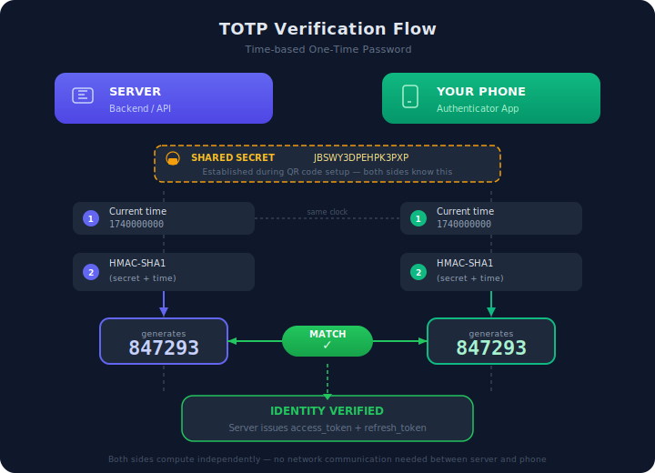

# Layer 4 — Two-Factor Authentication (2FA)

## The One-Sentence Summary

2FA means that **knowing your password is not enough to log in** — you must also prove you have something (your phone, a physical key, your fingerprint) before the server trusts you.

## Why Passwords Alone Are Not Enough

Layers 1–3 taught you how the server verifies identity: you send a username + password, the server checks them, and issues a token. That works — until someone gets your password.

**How passwords get stolen:**

```
Phishing       — fake login page tricks you into typing your password
Data breach    — a company's database gets hacked, your password leaks
Reuse          — you used the same password on two sites, one gets hacked
Keylogger      — malware records everything you type
Shoulder surf  — someone watches you type your password in a café
```

Once an attacker has your password, they can log in as you. The server has no way to tell the difference between you and someone who knows your password. Both send the same username + password.

**2FA closes this gap.** Even if someone steals your password, they still cannot log in — because they don't have the second factor.

## What Are "Factors"?

A **factor** is a category of proof. There are three categories:

| Factor                 | What it means            | Examples                                  |
| ---------------------- | ------------------------ | ----------------------------------------- |
| **Something you know** | Information in your head | Password, PIN, security question          |
| **Something you have** | A physical thing you own | Phone, hardware key (YubiKey), smart card |
| **Something you are**  | Your body itself         | Fingerprint, face scan, iris scan         |

**Single-factor authentication (1FA):** password only — one factor (something you know).

**Two-factor authentication (2FA):** password + one more factor from a **different category**.

**Important:** two passwords is NOT 2FA. Both are "something you know." True 2FA requires two **different** categories. Password (know) + phone code (have) = 2FA. Password + security question (know + know) = still just 1FA.

## How 2FA Works — The Flow

Here is what happens when 2FA is enabled on an account:

```
Step 1 — Normal login
  User sends: username + password
  Server verifies password
  But does NOT issue tokens yet

Step 2 — Server checks: does this user have 2FA enabled?
  If no  -> issue tokens, login complete (same as Layer 3)
  If yes -> respond with: "2FA required, provide your code"

Step 3 — User provides the second factor
  User sends: the 6-digit code from their authenticator app
  Server verifies the code

Step 4 — Both factors verified
  Server issues: access_token + refresh_token
  Login complete
```

**The key difference from Layer 3:** the server adds a checkpoint between password verification and token issuance. You must pass **both** checkpoints to get your tokens.

## The 6-Digit Code — How Does It Work?

The most common 2FA method is **TOTP** — Time-based One-Time Password. This is the 6-digit code you see in apps like Google Authenticator or Authy.

### Setup (one time only)

```
1. Server generates a random SECRET KEY (e.g., "JBSWY3DPEHPK3PXP")
2. Server shows it as a QR code
3. You scan the QR code with your authenticator app
4. Now both the server and your app share the same secret key
```

### Every time you log in

```
Your app takes:
  the shared secret key + the current time (rounded to 30 seconds)

Runs them through a hashing algorithm (HMAC-SHA1)

Produces a 6-digit number: 847 293

The server does the exact same calculation at the same time
  -> gets the same number: 847 293

If they match -> you have the right secret -> you have the right device
```

**Why the code changes every 30 seconds:** the current time is part of the calculation. Different time = different code. An old code is useless.

**Why it works offline:** your authenticator app does NOT contact the server. Both sides independently calculate the same code using the shared secret + current time. No internet needed on the phone.

```
Server                          Your Phone
  |                                |
  |   shared secret: JBSWY3D...   |
  |   current time:  1740000000   |
  |                                |
  |   HMAC-SHA1(secret, time)     |   HMAC-SHA1(secret, time)
  |        ↓                      |        ↓
  |     847293                    |     847293
  |                                |
  |   Do they match? YES         |
```

**Visual diagram:**



## 2FA Methods Compared

TOTP is not the only option. Here are the most common 2FA methods:

| Method                       | How it works                                 | Pros                            | Cons                                       |
| ---------------------------- | -------------------------------------------- | ------------------------------- | ------------------------------------------ |
| **TOTP (Authenticator app)** | App generates a time-based code every 30 sec | Offline, free, widely supported | Lose your phone = locked out (need backup) |
| **SMS code**                 | Server texts a code to your phone number     | Simple, no app needed           | Vulnerable to SIM swapping attacks         |
| **Email code**               | Server emails a code to your address         | No phone needed                 | If email is compromised, 2FA is useless    |
| **Hardware key (YubiKey)**   | Physical USB device you plug in or tap       | Most secure, phishing-proof     | Costs money, can be lost                   |
| **Biometric**                | Fingerprint or face scan on your device      | Convenient, hard to steal       | Device-dependent, not easily transferable  |

**For most applications, TOTP is the standard.** It is the best balance of security, cost (free), and user experience. SMS is considered **weak** because attackers can hijack phone numbers through SIM swapping — convincing a carrier to transfer your number to their SIM card.

## What Is a Backup/Recovery Code?

When you set up 2FA, the server gives you a set of **recovery codes** — typically 8–10 random strings:

```
a8f2-k9d1
m3p7-x4b2
j6n0-q5w8
...
```

**Why they exist:** if you lose your phone (your "something you have" factor), you lose access to your TOTP codes. Recovery codes are your emergency backup. Each one can be used **once** to log in without the 6-digit code.

**Store them safely.** Print them, put them in a password manager, or store them somewhere you will not lose them. Once used, a code is dead. Once all codes are used, you need admin help if you lose your phone.

## Where Is 2FA Used in a Real System?

Not every user action needs 2FA. You only trigger it at the **login gate**:

```
2FA happens here:
  └─ POST /api/v1/auth/login/
       └─ Password verified?
       └─ 2FA enabled?
            └─ Yes -> require TOTP code -> then issue tokens
            └─ No  -> issue tokens immediately

2FA does NOT happen here:
  └─ GET /api/v1/students/            <- already authenticated via token
  └─ POST /api/v1/disbursements/      <- already authenticated via token
  └─ POST /api/v1/auth/token/refresh/ <- refresh uses the refresh token
```

**2FA is a login-time check, not a per-request check.** Once you pass both factors and get your tokens, every API call works exactly like Layer 3 — you send the access token, the server verifies the signature, done. You do not enter a TOTP code for every button click.

### Who should have 2FA enabled?

In a system with roles (RBAC), 2FA is most critical for high-privilege accounts:

```
Platform Admin     — can suspend users, manage the system     -> 2FA required
Finance Admin      — can approve financial records             -> 2FA required
Executive          — can view sensitive reports                -> 2FA recommended
Finance Officer    — can create records (but not approve)     -> 2FA optional
Donor              — read-only access to own data             -> 2FA optional
```

The higher the privilege, the more damage a compromised account can cause, and the more important 2FA becomes.

## How 2FA Fits Into the Full Login Flow

Building on the flow from Layer 3, here is what changes when 2FA is enabled:

```
WITHOUT 2FA (Layer 3):
  POST /login { username, password }
    -> password valid?
    -> YES -> issue access_token + refresh_token -> done

WITH 2FA (Layer 4):
  POST /login { username, password }
    -> password valid?
    -> YES -> does user have 2FA enabled?
        -> NO  -> issue tokens -> done
        -> YES -> respond with { status: "2fa_required", temp_token: "..." }

  POST /login/2fa { temp_token, totp_code }
    -> verify temp_token (proves password was already checked)
    -> verify totp_code against user's stored secret
    -> BOTH valid -> issue access_token + refresh_token -> done
```

**Why a temp_token?** The server needs to remember that you already passed the password check. But it cannot issue real tokens yet (you haven't completed 2FA). So it gives you a temporary, short-lived token (valid for ~5 minutes) that says "this user passed step 1." You send it with your TOTP code in step 2.

## Common Questions

### Q: Can an attacker bypass 2FA if they steal my access token?

No need to bypass it. If they steal your **access token**, they already have a valid session — 2FA was completed before the token was issued. This is why Layer 3 (short-lived tokens, rotation, blacklisting) still matters. 2FA protects the **login gate**. Token security protects the **session**.

### Q: What if I lose my phone?

Use one of your recovery codes to log in. Then immediately set up 2FA on a new device. If you have no recovery codes left, contact the system administrator — they can temporarily disable 2FA on your account so you can log in and re-configure it.

### Q: Is 2FA annoying for users?

Only at login — and you only log in once per session (up to 24 hours with refresh tokens). After that, the token handles everything. Users do NOT enter a TOTP code for every action.

### Q: Can 2FA be hacked?

TOTP is very strong, but not invincible:

```
Attack                  | Does it beat TOTP?
------------------------|--------------------
Stolen password alone   | No  — still need the code
Phishing (real-time)    | Maybe — if attacker relays code instantly before it expires
SIM swap                | No  — TOTP is not SMS, it lives on your device
Stolen phone            | Yes — if phone has no lock screen (use a PIN!)
Stolen secret key       | Yes — but this requires server breach
```

**TOTP is not perfect, but it blocks the vast majority of attacks.** Most attackers have stolen passwords. Very few have the ability to perform real-time phishing relay attacks.

## Summary

| Question                          | Answer                                                            |
| --------------------------------- | ----------------------------------------------------------------- |
| What is 2FA?                      | Requiring two different types of proof to log in                  |
| What are the three factor types?  | Something you know, something you have, something you are         |
| What is TOTP?                     | A time-based 6-digit code generated by an app on your phone       |
| Why does the code change?         | The current time is part of the calculation — new time = new code |
| Does 2FA happen on every request? | No — only at login. After that, your token handles auth           |
| What if I lose my phone?          | Use a recovery code, then set up 2FA on a new device              |
| What is the best 2FA method?      | TOTP (authenticator app) — secure, free, works offline            |
| Why not use SMS?                  | Vulnerable to SIM swapping — attacker can hijack your number      |
