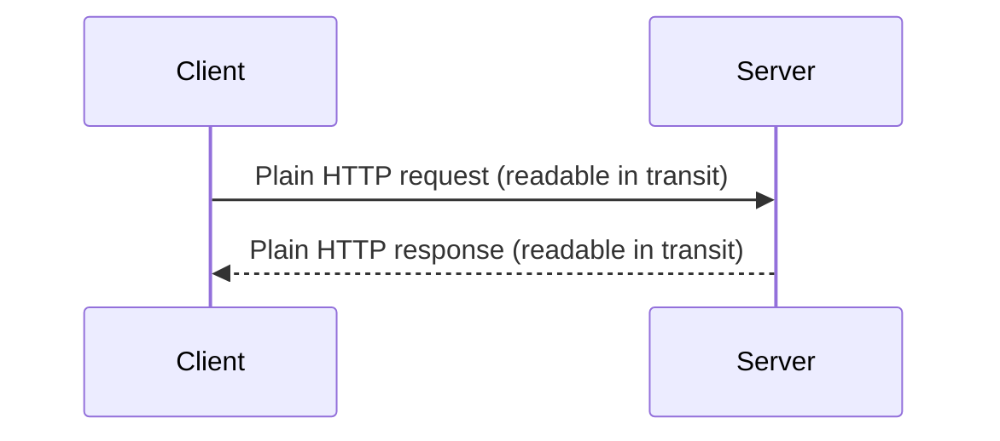
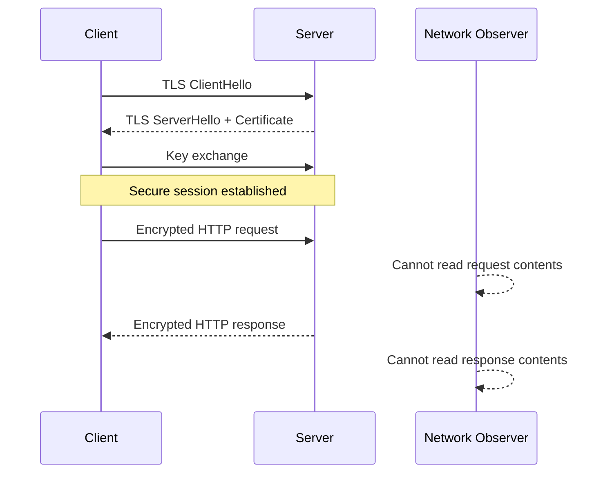

# HTTP and HTTPS

HTTP and HTTPS are the core protocols used for web and API communication.

- HTTP defines how clients and servers exchange requests and responses.
- HTTPS is HTTP protected by TLS encryption.

## What "HTTP Protocol" Means

A protocol is a formal set of communication rules between systems.

In this context, the HTTP protocol defines:

- The structure of requests and responses
- The meaning of methods (such as `GET`, `POST`, `PUT`, `PATCH`, `DELETE`)
- The meaning of status codes (such as `200`, `404`, `500`)
- How headers and message bodies are used

HTTP is an application-layer protocol. It is not the only protocol in networking.
Examples of other common protocols:

- Application layer: `HTTPS`, `DNS`, `SMTP`, `IMAP`, `FTP`, `WebSocket`
- Transport layer: `TCP`, `UDP`
- Network layer: `IP`

## How HTTP Communication Works

A client sends a request to a server, and the server returns a response.



HTTP is stateless. Each request is independent unless state is carried explicitly (for example, with cookies or tokens).

## HTTP Request Anatomy

A typical request includes:

- Method: what action to perform (`GET`, `POST`, `PUT`, `PATCH`, `DELETE`)
- Target: path and optional query string
- HTTP version
- Headers
- Optional body

Example raw request:

```http
POST /api/courses?page=1 HTTP/1.1
Host: api.example.com
Authorization: Bearer <token>
Content-Type: application/json
Accept: application/json

{"title":"REST Basics","duration":20}
```

## HTTP Response Anatomy

A typical response includes:

- Status code
- Headers
- Optional body

Example raw response:

```http
HTTP/1.1 201 Created
Content-Type: application/json
Location: /api/courses/42

{"id":42,"title":"REST Basics","duration":20}
```

## HTTP Methods (Verbs)

| Method   | Typical use                       | Body usually sent? | Idempotent? |
| -------- | --------------------------------- | ------------------ | ----------- |
| `GET`    | Read data                         | No                 | Yes         |
| `POST`   | Create resource or trigger action | Yes                | No          |
| `PUT`    | Replace resource completely       | Yes                | Yes         |
| `PATCH`  | Update part of a resource         | Yes                | Usually not |
| `DELETE` | Remove resource                   | Usually no         | Yes         |

Important: `UPDATE` is not an HTTP method. Use `PUT` or `PATCH`.

## What HTTPS Adds

HTTPS is HTTP over TLS (Transport Layer Security).

TLS provides:

- Confidentiality: encrypted traffic
- Integrity: detection of tampering
- Authentication: certificate-based server identity verification



### Difference Shown in the Diagrams

- In the HTTP diagram, request and response data are sent in plaintext and can be read in transit.
- In the HTTPS diagram, a TLS handshake happens first, then HTTP messages are encrypted.
- HTTPS adds encryption, integrity protection, and server identity verification; HTTP alone does not.

## HTTP vs HTTPS

| Feature                      | HTTP                      | HTTPS                                 |
| ---------------------------- | ------------------------- | ------------------------------------- |
| Encryption                   | No                        | Yes (TLS)                             |
| Default port                 | 80                        | 443                                   |
| Server identity verification | No                        | Yes                                   |
| Safe for sensitive data      | No                        | Yes                                   |
| Browser trust indicator      | Usually marked not secure | Marked secure if certificate is valid |

Using `POST` does not make data secure by itself. Security in transit comes from HTTPS.

## Status Code Families

| Range | Meaning       | Example                                                                                          |
| ----- | ------------- | ------------------------------------------------------------------------------------------------ |
| `1xx` | Informational | `101 Switching Protocols`                                                                        |
| `2xx` | Success       | `200 OK`, `201 Created`, `204 No Content`                                                        |
| `3xx` | Redirection   | `301 Moved Permanently`, `304 Not Modified`                                                      |
| `4xx` | Client error  | `400 Bad Request`, `401 Unauthorized`, `403 Forbidden`, `404 Not Found`, `429 Too Many Requests` |
| `5xx` | Server error  | `500 Internal Server Error`, `502 Bad Gateway`, `503 Service Unavailable`, `504 Gateway Timeout` |

## Common 4xx Errors (Client Side)

- `400 Bad Request`: invalid request structure or payload.
- `401 Unauthorized`: authentication is missing or invalid.
- `403 Forbidden`: authenticated but not allowed to perform this action.
- `404 Not Found`: resource or route does not exist.
- `405 Method Not Allowed`: route exists, but the HTTP method is not supported there.
- `409 Conflict`: state conflict, such as duplicate unique value.
- `422 Unprocessable Entity`: validation failed.
- `429 Too Many Requests`: rate limit exceeded.

## Common 5xx Errors (Server Side)

- `500 Internal Server Error`: unhandled server exception.
- `502 Bad Gateway`: upstream dependency returned an invalid response.
- `503 Service Unavailable`: service temporarily unavailable (maintenance or overload).
- `504 Gateway Timeout`: upstream service did not respond in time.

## Practical Guidelines

- Use HTTPS in development, staging, and production.
- Return precise status codes instead of always returning `200`.
- Validate request data before processing.
- Send consistent response formats (usually JSON for APIs).
- Log server errors with request IDs for debugging.
