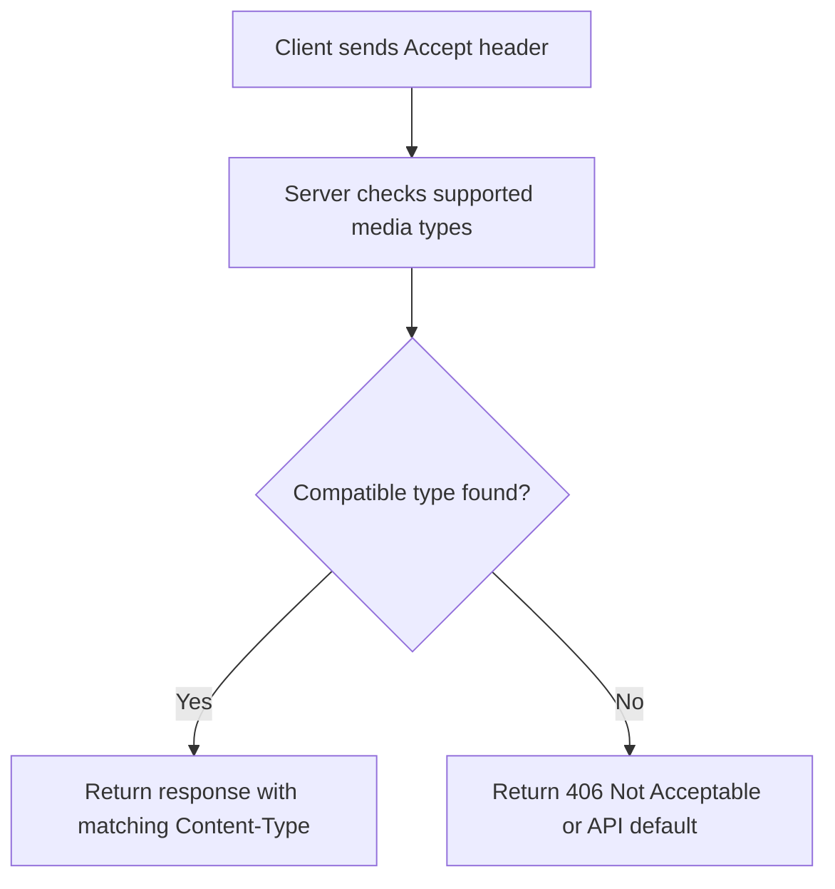

# Response Types and Content Negotiation

In HTTP APIs, response type means the media type returned in the `Content-Type` header.

Examples:

- `Content-Type: application/json`
- `Content-Type: application/xml`
- `Content-Type: text/plain`

## Why Response Types Matter

Different clients consume data differently:

- Web frontends usually expect JSON.
- Legacy integrations may require XML.
- Export endpoints may return CSV.

Response types make APIs flexible while keeping behavior explicit.

## `Accept` vs `Content-Type`

| Header         | Sent by           | Meaning                                       |
| -------------- | ----------------- | --------------------------------------------- |
| `Accept`       | Client            | Formats the client can accept in the response |
| `Content-Type` | Client and server | Format of the current message body            |

- In requests, `Content-Type` describes the request body format.
- In responses, `Content-Type` describes the response body format.

## How Content Negotiation Works



Example request headers:

- `Accept: application/json`
- `Accept: application/xml`
- `Accept: application/json, application/xml;q=0.8`

In the third line, `q=0.8` means XML is acceptable but lower priority than JSON.

## Common API Response Types

| Response type | Header value                    | Typical use                           |
| ------------- | ------------------------------- | ------------------------------------- |
| JSON          | `application/json`              | Default for modern REST APIs          |
| XML           | `application/xml` or `text/xml` | Legacy or enterprise integrations     |
| Plain text    | `text/plain`                    | Lightweight messages or health checks |
| HTML          | `text/html`                     | Browser pages                         |
| CSV           | `text/csv`                      | Data export endpoints                 |

## JSON vs XML

| Feature                | JSON                   | XML                                |
| ---------------------- | ---------------------- | ---------------------------------- |
| Structure              | Key-value + arrays     | Tag-based hierarchy                |
| Payload size           | Usually smaller        | Usually larger                     |
| Parsing in modern apps | Very common and simple | Common in older integrations       |
| Advanced metadata      | Limited                | Supports attributes and namespaces |
| Typical REST usage     | Most common default    | Optional/less common               |

## Practical Request and Response Examples

Requesting JSON:

```bash
curl -H "Accept: application/json" https://api.example.com/books/1
```

Response:

```http
HTTP/1.1 200 OK
Content-Type: application/json

{"id":1,"title":"Seawolf"}
```

Requesting XML:

```bash
curl -H "Accept: application/xml" https://api.example.com/books/1
```

Response:

```http
HTTP/1.1 200 OK
Content-Type: application/xml

<book><id>1</id><title>Seawolf</title></book>
```

## Related Error Codes

- `406 Not Acceptable`: server cannot produce any format from the `Accept` header.
- `415 Unsupported Media Type`: request body format is not supported by the endpoint.

Example `415` case:

- Client sends `Content-Type: application/xml`
- Endpoint only accepts JSON

## Best Practices

- Use JSON as default unless another format is required.
- Document exactly which response types each endpoint supports.
- Always set the response `Content-Type` header correctly.
- Validate request `Content-Type` for write operations.
- Keep error responses consistent in one format (usually JSON).
