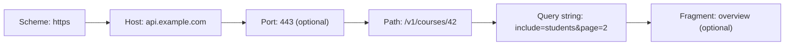
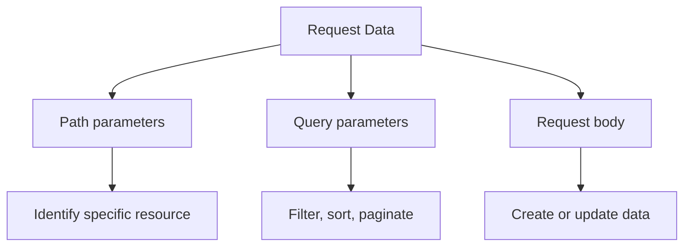

# URL, Path Parameters, Query Parameters, and Body Data

A URL (Uniform Resource Locator) is the address of a resource on the web.

When you call an API endpoint, the URL tells the server which resource you want, and optional parameters add context like filters or pagination.

Example:
`https://api.example.com:443/v1/courses/42?include=students&page=2#overview`



## URL Parts

| Part                    | Example                    | Purpose                                                     |
| ----------------------- | -------------------------- | ----------------------------------------------------------- |
| Scheme (protocol)       | `https`                    | Defines how data is transferred.                            |
| Host                    | `api.example.com`          | Domain (or IP address) of the server.                       |
| Port (optional)         | `443`                      | Network port. Default is `443` for HTTPS and `80` for HTTP. |
| Path                    | `/v1/courses/42`           | Identifies the resource on the server.                      |
| Query string (optional) | `?include=students&page=2` | Optional filters/options sent as key-value pairs.           |
| Fragment (optional)     | `#overview`                | Client-side anchor. Usually not sent to the server.         |

## Absolute vs Relative URL

- Absolute URL: includes scheme + host, for example `https://api.example.com/v1/courses`.
- Relative URL: path only, for example `/v1/courses`.

Use absolute URLs when sharing external links, and relative URLs inside the same application where appropriate.

## Parameter Types



### 1. Path Parameters

Path parameters are part of the path and usually identify one specific resource.

Example:
`GET /courses/42`

`42` is the path parameter.

```py
# urls.py
from django.urls import path
from .views import course_detail

urlpatterns = [
    path("courses/<int:course_id>/", course_detail),
]
```

```py
# views.py
from django.http import HttpResponse

def course_detail(request, course_id):
    return HttpResponse(f"Course ID: {course_id}")
```

### 2. Query Parameters

Query parameters come after `?` and are separated by `&`.

Example:
`GET /courses?category=backend&page=2&sort=name`

- Query string: `category=backend&page=2&sort=name`
- Query parameters: `category=backend`, `page=2`, `sort=name`

```py
# views.py (Django)
from django.http import JsonResponse

def course_list(request):
    category = request.GET.get("category")
    page = request.GET.get("page", "1")
    sort = request.GET.get("sort", "name")
    return JsonResponse({"category": category, "page": page, "sort": sort})
```

In Django REST Framework, use `request.query_params`:

```py
# views.py (DRF)
from rest_framework.response import Response
from rest_framework.views import APIView

class CourseListView(APIView):
    def get(self, request):
        sort = request.query_params.get("sort", "name")
        return Response({"sort": sort})
```

For a focused explanation with more examples, see [query_string_and_params.md](./query_string_and_params.md).

### 3. Body Data (Request Payload)

Body data is used mainly with `POST`, `PUT`, and `PATCH` to create or update resources.

Important: Body data is not secure by default. Use HTTPS to encrypt traffic.

```py
# views.py (Django form data)
from django.http import HttpResponse

def capture_form(request):
    if request.method == "POST":
        name = request.POST.get("name")
        user_id = request.POST.get("id")
        return HttpResponse(f"name: {name}, id: {user_id}")
    return HttpResponse("Send a POST request.")
```

```py
# views.py (DRF JSON/form/multipart)
from rest_framework.response import Response
from rest_framework.views import APIView

class CourseCreateView(APIView):
    def post(self, request):
        title = request.data.get("title")
        return Response({"title": title})
```

## `request.GET["key"]` vs `request.GET.get("key")`

Both are Django patterns:

| Access pattern           | Behavior                            | Use when              |
| ------------------------ | ----------------------------------- | --------------------- |
| `request.GET["key"]`     | Raises `KeyError` if key is missing | Parameter is required |
| `request.GET.get("key")` | Returns `None` or provided default  | Parameter is optional |

## URL Encoding Basics

Some characters must be encoded in URLs:

- Space becomes `%20` (or `+` in query strings)
- `&` and `=` have special meaning in query strings

Example:

- Raw value: `machine learning`
- Encoded query: `q=machine%20learning`

If values are not encoded correctly, servers can parse parameters incorrectly.

## Path vs Query vs Body: Quick Decision

| Use case                       | Recommended place |
| ------------------------------ | ----------------- |
| Identify one resource (`id`)   | Path parameter    |
| Filter, sort, search, paginate | Query parameter   |
| Send new/updated object data   | Request body      |

## Quick Rules

- Keep URLs readable and predictable.
- Use nouns for resources (`/courses`, `/users`).
- Avoid putting sensitive data in the query string.
- Use HTTPS for any personal or confidential information.
