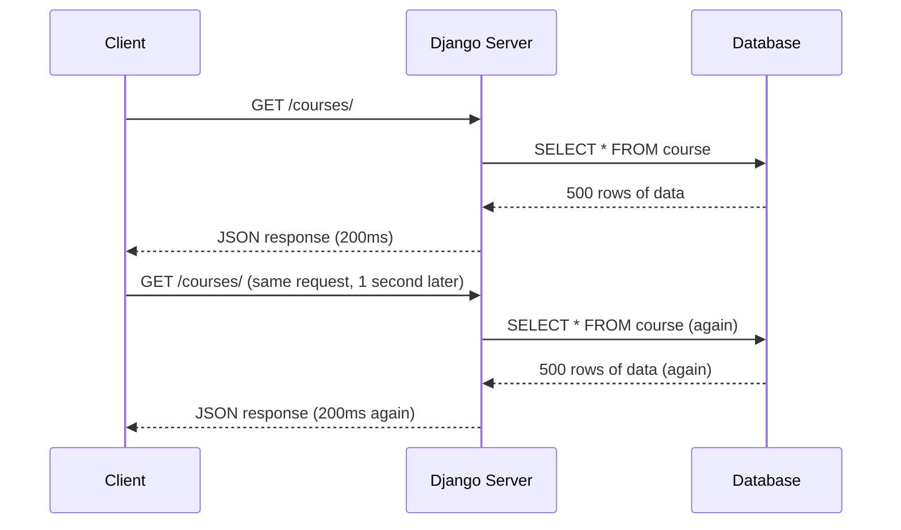
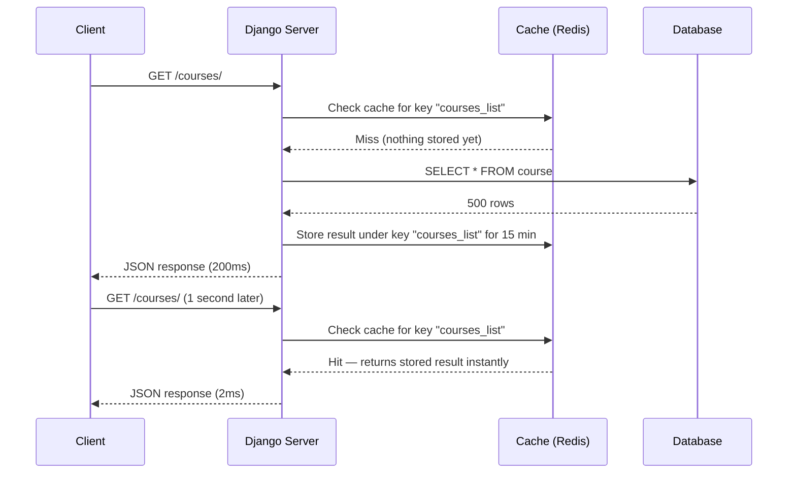
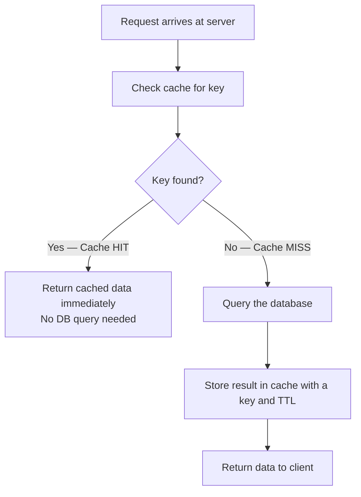
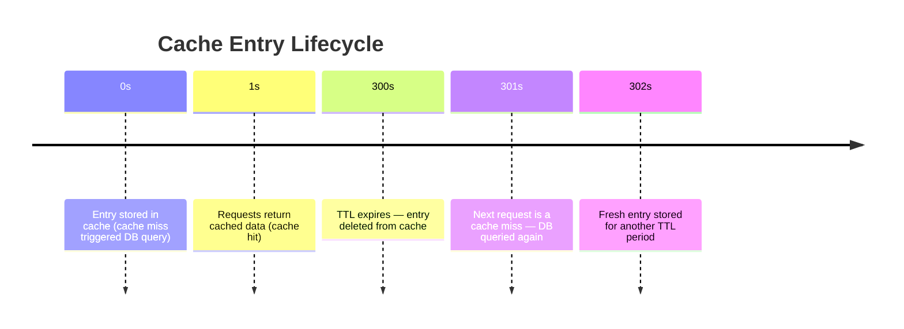
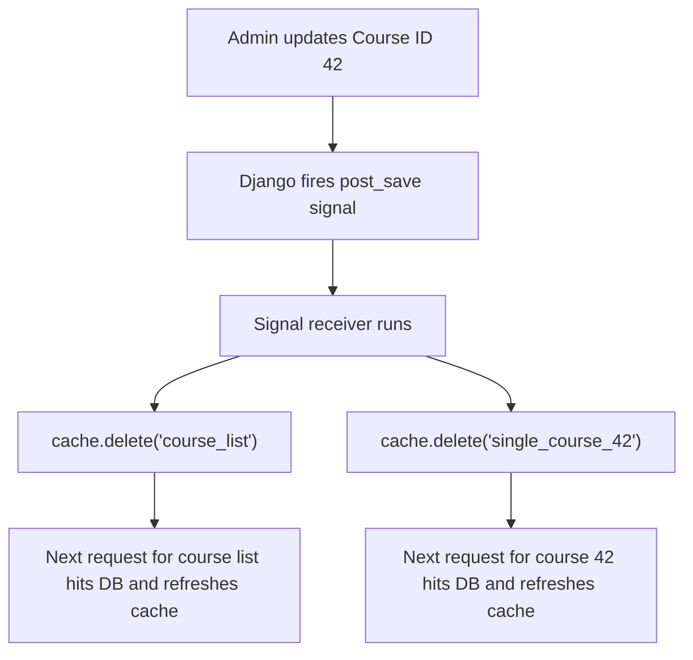
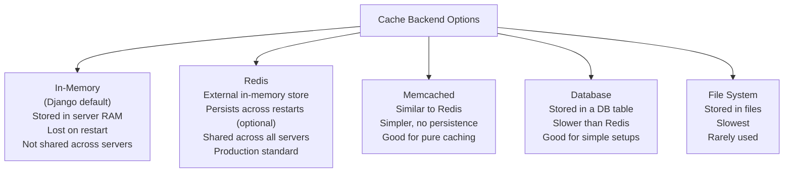
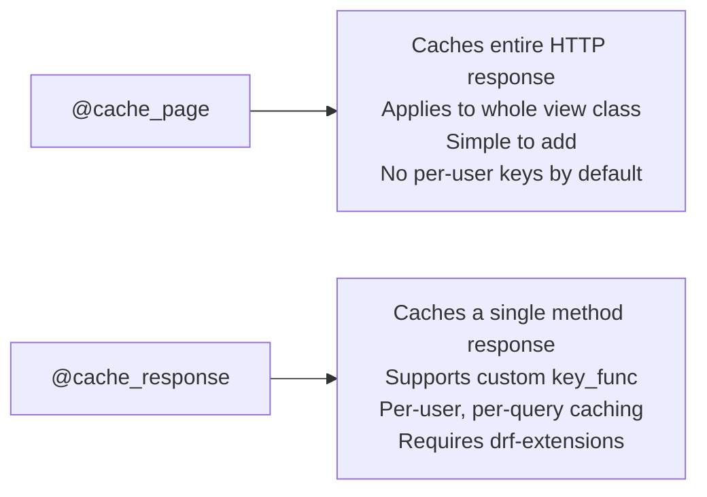

# Caching

## What is Caching?

Caching is the practice of storing a copy of a result so that the next time the same result is needed, you can return the stored copy instantly — without doing the expensive work again.

The "expensive work" is almost always one of:

- Querying the database
- Running a complex computation
- Making an external API call

Think of it like a notepad. The first time someone asks you what 347 × 892 is, you do the math and write the answer on the notepad. The next time someone asks the same question, you just read the notepad instead of recalculating.

## The Problem Caching Solves

Without caching, every single request triggers a full round-trip:



Every identical request costs the same. If 1,000 users hit `GET /courses/` at the same time, the database runs the same query 1,000 times.

With caching:



The database is only hit once. Every subsequent request for the same data is served from cache in milliseconds.

---

## Cache Hit and Cache Miss

These are the two fundamental states of a cache lookup:



- **Cache Hit** — the data was found in the cache. Fast. No DB involved.
- **Cache Miss** — the data was not in the cache. The server falls back to the database, stores the result, and returns it.

The goal is to maximize hits and minimize misses for data that does not change often.

---

## Cache Keys

Every cached item is stored under a **key** — a unique string identifier. When a new request arrives, the server generates the same key and looks it up. If the key exists in the cache, it is a hit.

Keys are usually derived from the request:

- URL: `"http://127.0.0.1:8000/courses/"` → key might be the full URL
- URL + query params: `/courses/?level=easy&page=1`
- URL + user ID: for user-specific data

### Default key (URL-based)

```py
# DRF uses the full URL as the key by default
key = "http://127.0.0.1:8000/courses/?search=machine&userid=100"
```

### Custom key function

```py
def key_func(view_instance, view_method, request, args, kwargs):
    key_parts = [
        'course_list',
        str(request.query_params),
        str(request.user.id if request.user.is_authenticated else 'anonymous')
    ]
    return ':'.join(key_parts)

# Resulting key: "course_list:{'search': 'machine'}:100"
```

Custom keys are shorter and more readable. They also let you invalidate specific groups of keys (e.g., delete all keys starting with `course_list` when a course changes).

---

## TTL — Time To Live

Every cached entry has a **TTL (Time To Live)**: the number of seconds before the cache automatically deletes it. After the TTL expires, the next request becomes a cache miss and the data is refreshed from the database.



Choosing the right TTL is a balance:

- **Too short** — cache expires too fast, DB gets hit too often (defeats the purpose)
- **Too long** — stale data stays cached, users see outdated results

Common values:
| Data type | Suggested TTL |
|-----------|--------------|
| Static reference data (categories, config) | 1 hour – 24 hours |
| Course list (changes occasionally) | 15 minutes |
| Single course detail | 15 minutes |
| User-specific data (profile, basket) | 5 minutes or session-based |
| Real-time data (stock prices, live scores) | Do not cache, or 10–30 seconds |

---

## Cache Invalidation

TTL handles expiry automatically, but sometimes data changes before the TTL expires — for example, a course is edited. You need to **invalidate** (delete) the stale cache entry immediately so users get fresh data.



In Django, you hook into model signals to trigger invalidation automatically:

```py
# signals.py
from django.db.models.signals import post_save, post_delete
from django.dispatch import receiver
from django.core.cache import cache
from .models import Course

@receiver([post_save, post_delete], sender=Course)
def invalidate_course_cache(sender, instance, **kwargs):
    cache.delete('course_list')
    cache.delete(f'single_course_{instance.pk}')
```

- `post_save` fires after a record is created or updated
- `post_delete` fires after a record is deleted
- `cache.delete(key)` removes the entry from the cache store (Redis, memory, etc.)

---

## Where is Cached Data Stored?



### Django Default (In-Memory / LocMemCache)

If you add nothing to `settings.py`, Django uses `LocMemCache` — Python dictionary stored in the process's own RAM.

```py
# This is the implicit default — no config needed
CACHES = {
    "default": {
        "BACKEND": "django.core.cache.backends.locmem.LocMemCache",
    }
}
```

Problems with this for production:

- If you have 3 server processes, each has its own separate cache — they do not share data
- The cache is wiped every time the server restarts or redeploys
- RAM on your application server is shared with your app code — cache competes for it

### Redis (Production Standard)

Redis is a standalone in-memory data store. All your Django processes connect to the same Redis instance, so the cache is shared and consistent. See [redis.md](./redis.md) for full setup.

---

## Django Caching Methods

### Method 1 — Cache Entire View with @cache_page (Django built-in)

Caches the complete HTTP response for a function-based or class-based view. Simple to add, coarse-grained control.

```py
from django.views.decorators.cache import cache_page
from django.utils.decorators import method_decorator
from rest_framework import generics

@method_decorator(cache_page(60 * 15), name="dispatch")   # cache for 15 minutes
class CourseList(generics.ListAPIView):
    queryset = Course.objects.all()
    serializer_class = CourseSerializer
```

`60 * 15` = 900 seconds = 15 minutes. The `name="dispatch"` tells Django to apply the cache decorator to the `dispatch` method, which runs on every request before routing to `get`, `post`, etc.

### Method 2 — Cache Individual Methods with @cache_response (drf-extensions)

More precise. Caches only a specific method (e.g., only `get`, not `post`). Also supports custom key functions.

```sh
pip install drf-extensions
```

```py
from rest_framework_extensions.cache.decorators import cache_response
from rest_framework.views import APIView
from rest_framework.response import Response

class CourseList(APIView):
    @cache_response(timeout=60 * 15)
    def get(self, request):
        courses = Course.objects.all()
        serializer = CourseSerializer(courses, many=True)
        return Response(serializer.data)
```

With a custom key function (to cache per-user or per-query-param):

```py
def course_key_func(view_instance, view_method, request, args, kwargs):
    return ':'.join([
        'course_list',
        str(request.query_params),
        str(request.user.id if request.user.is_authenticated else 'anon')
    ])

class CourseList(APIView):
    @cache_response(timeout=60 * 15, key_func=course_key_func)
    def get(self, request):
        courses = Course.objects.all()
        serializer = CourseSerializer(courses, many=True)
        return Response(serializer.data)
```

### Comparison



---

## Caching with Pagination

When a list endpoint uses pagination, each page has different data — so each page needs its own cache key. The cache key must include the page number and any filters.

```
course_list:{'level': 'easy', 'page': '1'}:anonymous
course_list:{'level': 'easy', 'page': '2'}:anonymous
course_list:{'search': 'python', 'page': '1'}:42
```

The custom `key_func` handles this automatically because `request.query_params` already contains `page`, `perpage`, `search`, etc.

---

## When Should You Cache?

Cache data when ALL of these are true:

1. The data is read far more often than it is written
2. The data is the same (or acceptable to be slightly stale) for all users requesting it
3. Generating the data is expensive (slow DB query, external API call, computation)

Do NOT cache when:

- Data changes frequently and users must always see the latest (e.g., bank balances, live inventory)
- Data is user-specific and differs per request in a way that makes caching inefficient
- The endpoint is rarely called — the overhead of caching is not worth it
