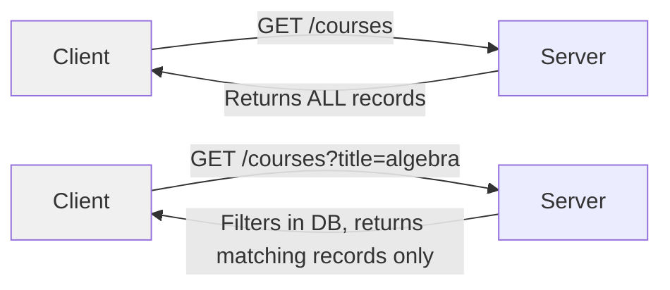
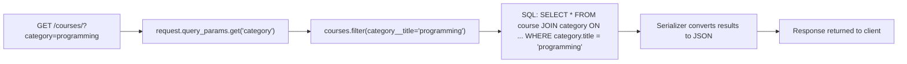

# Filtering

## What is Filtering?

Filtering is the process of returning only the records that match a condition the client specifies. Instead of returning every course in the database, the client can say "only give me courses where the title contains 'algebra'" or "only give me courses that cost less than 400".

Clients pass these conditions as query parameters in the URL.

## Two Approaches: Who Does the Filtering?



### Approach 1 — Client-Side Filtering

The server sends all records and the client filters them locally (e.g., in JavaScript).

- Simple to implement on the server
- Very inefficient: if you need 10 records out of 10,000, you still transfer all 10,000 over the network

### Approach 2 — Server-Side Filtering (Correct Approach)

The server receives the filter conditions, applies them to the database query, and returns only the matching records.

- Less data transferred over the network
- The database does the heavy lifting efficiently
- This is the standard approach for REST APIs

---

## How Filtering Works in DRF (APIView)

Query parameters are the key-value pairs after `?` in the URL. You read them in your view with `request.query_params.get("key")`.

### Example 1 — Filter by Exact Title

URL: `GET /api/courses/?title=algebra`

```py
class Courses(APIView):
    def get(self, request):
        courses = Course.objects.all()           # start with all records
        course_title = request.query_params.get("title")

        if course_title:
            courses = courses.filter(title=course_title)  # narrow down

        serializer = CourseSerializer(courses, many=True)
        return Response(serializer.data)
```

`Course.objects.all()` fetches every record. `.filter(title=course_title)` narrows it down to only records where `title` exactly matches the value. Django translates this into a SQL `WHERE title = 'algebra'` query.

### Example 2 — Filter by Multiple Parameters

Combine multiple filters with `&` in the URL:

URL: `GET /api/courses/?title=algebra&price=400`

```py
class Courses(APIView):
    def get(self, request):
        courses = Course.objects.all()
        course_title = request.query_params.get("title")
        to_price = request.query_params.get("price")

        if course_title:
            courses = courses.filter(title__icontains=course_title)  # case-insensitive partial match
        if to_price:
            courses = courses.filter(price__lte=to_price)            # price less than or equal to

        serializer = CourseSerializer(courses, many=True)
        return Response(serializer.data)
```

Each `.filter()` call narrows the queryset further. They chain together with AND logic — both conditions must be true.

---

## Django ORM Filter Lookups

The double underscore (`__`) syntax is Django's way of specifying how to compare a field's value. The format is:

```
ModelField__lookup = value
```

### Text Lookups

| Lookup | Example | What it does |
|--------|---------|-------------|
| _(none)_ | `filter(title="algebra")` | Exact match |
| `contains` | `filter(title__contains="alg")` | Case-sensitive, field contains the value |
| `icontains` | `filter(title__icontains="alg")` | Case-insensitive, field contains the value |
| `startswith` | `filter(title__startswith="alg")` | Starts with (case-sensitive) |
| `istartswith` | `filter(title__istartswith="alg")` | Starts with (case-insensitive) |

### Number / Date Lookups

| Lookup | Example | What it does |
|--------|---------|-------------|
| `lte` | `filter(price__lte=400)` | Less than or equal to |
| `gte` | `filter(price__gte=100)` | Greater than or equal to |
| `lt` | `filter(price__lt=400)` | Strictly less than |
| `gt` | `filter(price__gt=100)` | Strictly greater than |

### Examples

```py
# Courses where price is 400 or less
courses = courses.filter(price__lte=400)

# Courses where price is 100 or more
courses = courses.filter(price__gte=100)

# Courses whose title contains "python" (case-insensitive)
courses = courses.filter(title__icontains="python")

# Courses whose title starts with "intro" (case-insensitive)
courses = courses.filter(title__istartswith="intro")
```

---

## Filtering Across Related Models (Foreign Key)

When a model has a relationship to another model (ForeignKey), you can still filter through it using the same `__` syntax:

```
filter(relatedModelName__fieldName=value)
```

### Example — Models with a Relationship

```py
# models.py
from django.db import models

class Category(models.Model):
    slug = models.SlugField()
    title = models.CharField(max_length=120)

    def __str__(self):
        return self.title

class Course(models.Model):
    title = models.CharField(max_length=120)
    instructor = models.CharField(max_length=120)
    price = models.FloatField()
    category = models.ForeignKey(Category, on_delete=models.PROTECT)
```

`ForeignKey` means each `Course` belongs to one `Category`. Django stores the `category_id` on the Course row in the database. To filter courses by their category's title:

```py
class Courses(APIView):
    def get(self, request):
        courses = Course.objects.all()
        category_title = request.query_params.get("category")

        if category_title:
            # traverse the FK: Course -> Category -> title
            courses = courses.filter(category__title=category_title)

        serializer = CourseSerializer(courses, many=True)
        return Response(serializer.data)
```

URL: `GET /api/courses/?category=programming`

Django performs a SQL JOIN behind the scenes. You do not write the JOIN yourself — the `__` notation handles it.


