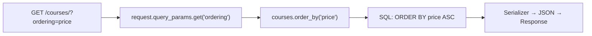
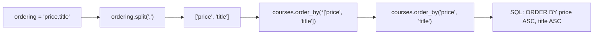

# Ordering

## What is Ordering?

Ordering (also called sorting) means controlling the sequence in which results are returned. Instead of getting courses in the order they were inserted into the database, the client can ask "sort these by price, lowest first" or "sort by title alphabetically".

Like filtering, ordering is controlled by query parameters in the URL.

## How it Works



---

## Basic Ordering (APIView)

The client passes an `ordering` query parameter with the field name to sort by.

URL: `GET /api/courses/?ordering=price`

```py
class Courses(APIView):
    def get(self, request):
        courses = Course.objects.all()
        ordering = request.query_params.get("ordering")

        if ordering:
            courses = courses.order_by(ordering)

        serializer = CourseSerializer(courses, many=True)
        return Response(serializer.data)
```

`courses.order_by("price")` tells Django to sort the SQL query by the `price` column. By default, this is ascending — lowest to highest.

### Reverse Order (Descending)

To sort in descending order (highest to lowest), the client adds a `-` prefix before the field name:

```
GET /api/courses/?ordering=-price     → most expensive first
GET /api/courses/?ordering=price      → cheapest first
GET /api/courses/?ordering=-title     → Z to A
GET /api/courses/?ordering=title      → A to Z
```

This works automatically — Django's `order_by("-price")` means descending.

---

## Ordering by Multiple Fields

Sometimes you want a secondary sort. For example: sort by price first, and if two courses have the same price, sort those by title alphabetically.

The client separates multiple fields with a comma:

```
GET /api/courses/?ordering=price,title
```

On the server, split the string and unpack it into `order_by`:

```py
class Courses(APIView):
    def get(self, request):
        courses = Course.objects.all()
        ordering = request.query_params.get("ordering")

        if ordering:
            order_fields = ordering.split(",")   # "price,title" → ["price", "title"]
            courses = courses.order_by(*order_fields)  # order_by("price", "title")

        serializer = CourseSerializer(courses, many=True)
        return Response(serializer.data)
```

### What `split` and `*` do here



- `.split(",")` breaks the string at every comma and returns a list: `["price", "title"]`
- `*` (the unpacking operator) expands the list into individual arguments, so `order_by(*["price", "title"])` becomes `order_by("price", "title")`

Without `*` you would be passing a list object as one argument, which would not work.

---

## Ordering with Generic Views (OrderingFilter)

When using DRF's generic views, you can use the built-in `OrderingFilter` backend instead of writing the ordering logic manually.

Add it to `settings.py`:

```py
# settings.py
REST_FRAMEWORK = {
    'DEFAULT_FILTER_BACKENDS': [
        'django_filters.rest_framework.DjangoFilterBackend',
        'rest_framework.filters.OrderingFilter',   # add this
        'rest_framework.filters.SearchFilter',
    ],
}
```

Then declare which fields are allowed to be sorted on in the view:

```py
from rest_framework import generics, filters
from .models import Course
from .serializers import CourseSerializer

class CourseList(generics.ListAPIView):
    queryset = Course.objects.all()
    serializer_class = CourseSerializer
    filter_backends = [filters.OrderingFilter]
    ordering_fields = ['price', 'title', 'course_start_date']  # client can sort by these
    ordering = ['title']   # default ordering when no ?ordering= is provided
```

The `ordering_fields` list acts as a whitelist — the client can only sort by fields you explicitly allow. This prevents clients from sorting by sensitive fields like internal IDs or timestamps you did not intend to expose.

URL examples:

```
GET /courses/?ordering=price             → cheapest first
GET /courses/?ordering=-price            → most expensive first
GET /courses/?ordering=price,title       → by price, then by title
GET /courses/?ordering=-course_start_date → most recently started first
```

---

## Summary

| Feature | Manual (APIView) | Automatic (OrderingFilter) |
|---------|-----------------|---------------------------|
| Setup | Write `order_by()` logic yourself | Declare `ordering_fields` on the view |
| Descending | Client sends `-fieldname` | Same |
| Multiple fields | Split comma-separated string, unpack with `*` | Same, handled automatically |
| Field whitelisting | You control it in code | Via `ordering_fields` list |
| Default ordering | Set manually in code | Via `ordering` attribute |
