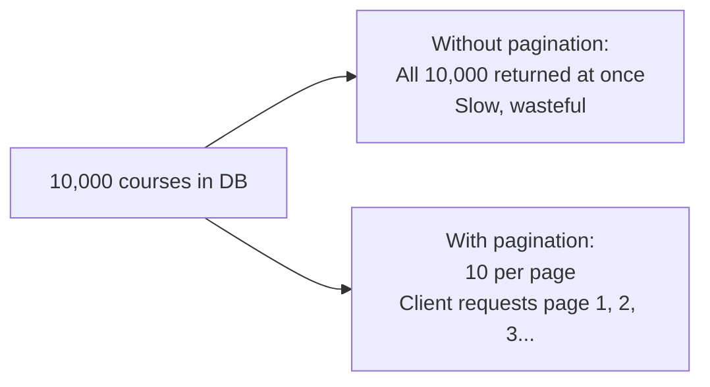
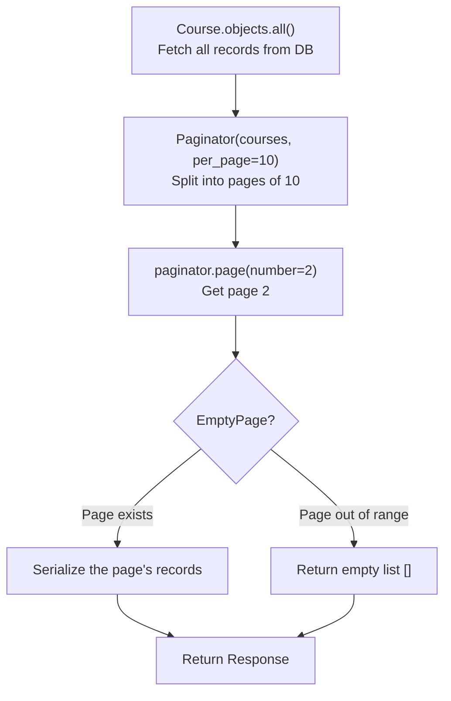
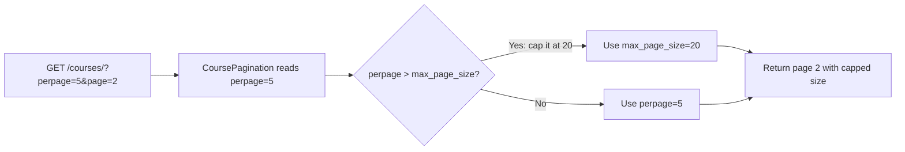
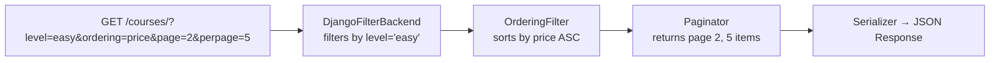

# Pagination

## What is Pagination?

Pagination is the process of splitting a large list of results into smaller chunks called pages, and returning one page at a time. Instead of returning all 10,000 courses at once, you return 10 per request and let the client ask for the next page when it is ready.

Without pagination, a single API request could transfer megabytes of data, slow down the server, and crash the client trying to render it all.



---

## How Clients Request Pages

The client passes two query parameters:

- `page` — which page number to fetch
- `perpage` (or `limit`) — how many items per page

```
GET /courses/?perpage=10&page=1    → first 10 courses
GET /courses/?perpage=10&page=2    → next 10 courses
GET /courses/?perpage=10&page=3    → next 10 after that
```

You should also enforce a **maximum page size** to prevent a client from requesting `perpage=100000`.

---

## Manual Pagination with APIView

Django's built-in `Paginator` class handles the math of splitting a queryset into pages.

```py
# views.py
from django.core.paginator import Paginator, EmptyPage
from rest_framework.views import APIView
from rest_framework.response import Response

class Courses(APIView):
    def get(self, request):
        courses = Course.objects.all()

        perpage = request.query_params.get("perpage", default=2)  # default: 2 per page
        page = request.query_params.get("page", default=1)        # default: page 1

        paginator = Paginator(courses, per_page=perpage)

        try:
            courses = paginator.page(number=page)
        except EmptyPage:
            courses = []   # page number is out of range — return empty list

        serializer = CourseSerializer(courses, many=True)
        return Response(serializer.data)
```

### What each part does



- `Paginator(queryset, per_page=N)` — wraps the queryset and divides it into pages of N items
- `paginator.page(number=N)` — returns the records for page N
- `EmptyPage` — raised when the requested page number is beyond the last page. Catching it prevents a 500 server error

---

## Automatic Pagination with Generic Views

When using DRF generic views, you can configure pagination globally in `settings.py` and it applies automatically to all list views.

```py
# settings.py
REST_FRAMEWORK = {
    'DEFAULT_PAGINATION_CLASS': 'rest_framework.pagination.PageNumberPagination',
    'PAGE_SIZE': 10,   # default: 10 items per page
}
```

`PageNumberPagination` is DRF's built-in pagination class. With this setting, any `ListAPIView` or `ListCreateAPIView` automatically paginates its results. The response also includes metadata like total count and links to the next/previous page.

URL:

```
GET /courses/?page=2    → returns page 2 with 10 items
```

Response shape with pagination:

```json
{
    "count": 87,
    "next": "http://127.0.0.1:8000/courses/?page=3",
    "previous": "http://127.0.0.1:8000/courses/?page=1",
    "results": [...]
}
```

---

## Custom Pagination Class (Per-View)

When you need different pagination settings for one specific view — a different page size, a different query parameter name, or a maximum cap — you create a custom pagination class and assign it to that view.

```py
# views.py
from rest_framework.pagination import PageNumberPagination
from rest_framework.generics import ListAPIView
from .models import Course
from .serializers import CourseSerializer

class CoursePagination(PageNumberPagination):
    page_size = 10                       # default items per page
    page_size_query_param = "perpage"    # client can override with ?perpage=5
    max_page_size = 20                   # client cannot request more than 20

class CourseListView(ListAPIView):
    queryset = Course.objects.all()
    serializer_class = CourseSerializer
    pagination_class = CoursePagination  # use this custom paginator
```



URL examples:

```
GET /courses/?perpage=5           → 5 items on page 1
GET /courses/?perpage=5&page=2    → 5 items on page 2
GET /courses/?perpage=50          → capped at 20 (max_page_size)
```

### Custom pagination attributes

| Attribute               | What it does                                                               |
| ----------------------- | -------------------------------------------------------------------------- |
| `page_size`             | Default number of items per page                                           |
| `page_size_query_param` | The query parameter name the client uses to set page size (e.g. `perpage`) |
| `max_page_size`         | The maximum the client is allowed to request — prevents abuse              |

---

## Global Pagination with Dynamic Page Size

If you want the `perpage` parameter to work globally across all views, set it in `settings.py`:

```py
# settings.py
REST_FRAMEWORK = {
    'DEFAULT_PAGINATION_CLASS': 'rest_framework.pagination.PageNumberPagination',
    'PAGE_SIZE': 10,
}
```

Note: The global `PAGE_SIZE_QUERY_PARAM` setting does not always work reliably. When in doubt, define a custom pagination class on the view directly — that is always more predictable.

---

## Combining Pagination with Filtering and Ordering

All three work together. The filter and ordering are applied to the full queryset first, then pagination splits the filtered, sorted result into pages.



The order of operations is always: **filter → order → paginate → serialize**.
