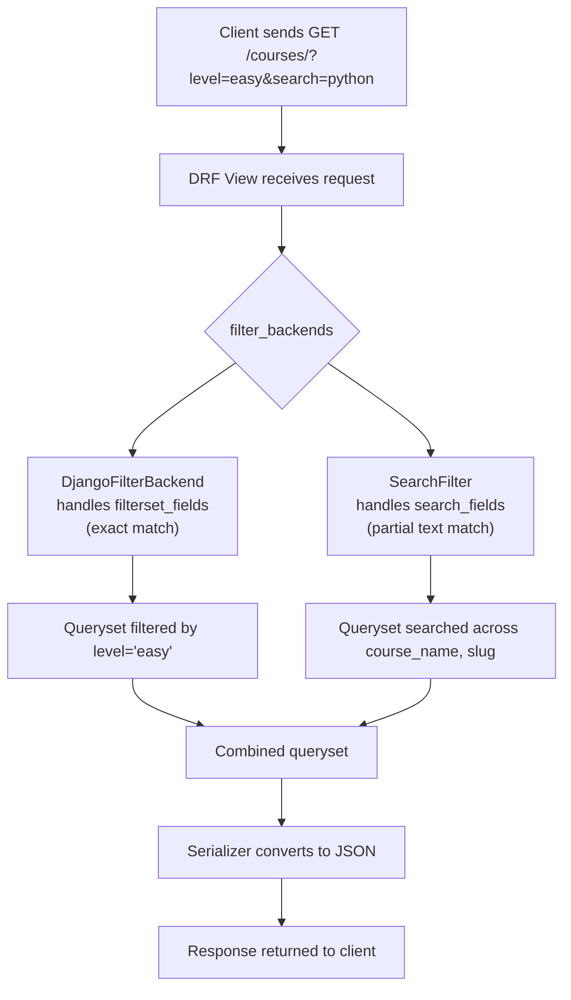
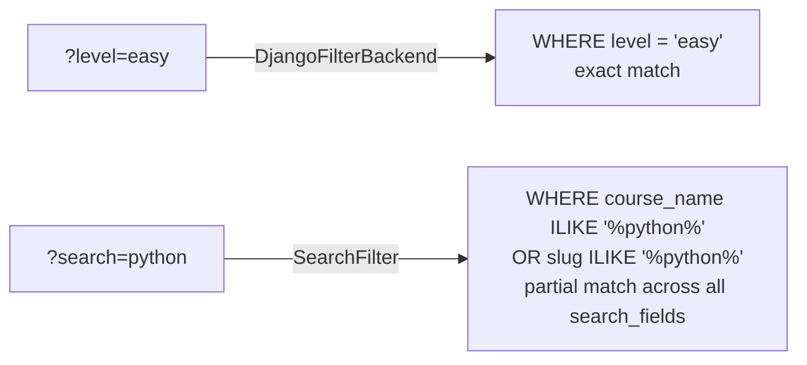
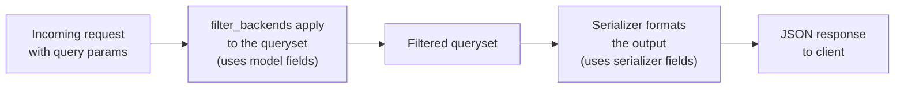

# Filtering in Class-Based Views with django-filter

## Why a Separate Package?

The manual filtering in `filtering.md` works, but it requires you to write the `if` checks and `.filter()` calls yourself for every field. As the number of filterable fields grows, this gets repetitive.

`django-filter` is a third-party package that automates this. You declare which fields are filterable, and it generates the filtering logic for you. It integrates directly with DRF's generic views.

## How it Fits Together



## Installation

```sh
pip install django-filter
```

## Configuration in settings.py

`REST_FRAMEWORK` is a dictionary in your Django settings file where you configure DRF's global defaults. Here we tell DRF which filter backends to use for all views.

A **filter backend** is a class that DRF calls on every request to apply filtering, searching, or ordering to the queryset before the serializer runs.

```py
# settings.py
REST_FRAMEWORK = {
    'DEFAULT_FILTER_BACKENDS': (
        'django_filters.rest_framework.DjangoFilterBackend',  # exact field filtering
        'rest_framework.filters.SearchFilter',                # text search
    ),
    'DEFAULT_RENDERER_CLASSES': (
        'rest_framework.renderers.JSONRenderer',
    ),
}
```

If you also want the browsable API (DRF's built-in browser interface for testing endpoints), add `django_filters` to `INSTALLED_APPS`:

```py
# settings.py
INSTALLED_APPS = [
    # ... other apps
    'django_filters',
]
```

## Updating Your View

Instead of writing `if` checks and `.filter()` calls manually, you declare three attributes on the view class:

- `filter_backends` — which filtering systems to activate for this view
- `filterset_fields` — which model fields support exact-match filtering (`?level=easy`)
- `search_fields` — which model fields support partial text search (`?search=python`)

```py
# views.py
from rest_framework import generics, filters, status
from rest_framework.response import Response
from django_filters.rest_framework import DjangoFilterBackend
from .models import Course
from .serializers import CourseSerializer

class CourseList(generics.ListCreateAPIView):
    queryset = Course.objects.all()
    serializer_class = CourseSerializer
    filter_backends = [DjangoFilterBackend, filters.SearchFilter]
    filterset_fields = ['level', 'course_start_date']   # exact match
    search_fields = ['course_name', 'slug']             # partial text search

    def create(self, request, *args, **kwargs):
        serializer = self.get_serializer(data=request.data)
        serializer.is_valid(raise_exception=True)
        self.perform_create(serializer)
        return Response(
            {"message": "Course created successfully", "course": serializer.data},
            status=status.HTTP_201_CREATED
        )
```

## Example Queries

### Exact Filtering (filterset_fields)

Filters by exact match. The field name in the URL must match a field listed in `filterset_fields`.

```
GET /courses/list/?level=easy
GET /courses/list/?course_start_date=2024-12-01
GET /courses/list/?level=easy&course_start_date=2024-12-01
```

### Text Search (search_fields)

Always uses the query parameter `?search=`. It performs a case-insensitive partial match (`icontains`) across all fields listed in `search_fields` at once.

```
GET /courses/list/?search=machine
GET /courses/list/?search=machine learning
```

The second query returns any course where `course_name` or `slug` contains "machine" OR "learning". You do not need to specify the field name — `search` applies across all `search_fields` simultaneously.

## Search vs Filter — Key Difference



| Aspect          | Filter (`filterset_fields`)  | Search (`search_fields`)       |
| --------------- | ---------------------------- | ------------------------------ |
| Query param     | Field name: `?level=easy`    | Always `?search=value`         |
| Match type      | Exact match                  | Case-insensitive partial match |
| Fields searched | Only the one field specified | All `search_fields` at once    |
| Use case        | Dropdown-style filters       | Free-text search bar           |

## Filtering Across Related Models (Foreign Key)

When a field belongs to a related model, use Django's double-underscore notation in `filterset_fields`:

```py
filterset_fields = ['level', 'subject__title']  # subject is a ForeignKey on Course
```

URL: `GET /courses/?subject__title=programming`

The `search_fields` attribute works the same way:

```py
search_fields = ['course_name', 'slug', 'subject__title', 'subject__description']
```

## Important: filterset_fields vs serializer fields

`filterset_fields` and `search_fields` must match **model field names**, not serializer field names. The serializer controls what is returned in the response. The filter backends work directly on the database queryset, before serialization happens.



If your serializer renames a field or adds a computed field, that computed field cannot be used in `filterset_fields` — only real model fields can.
